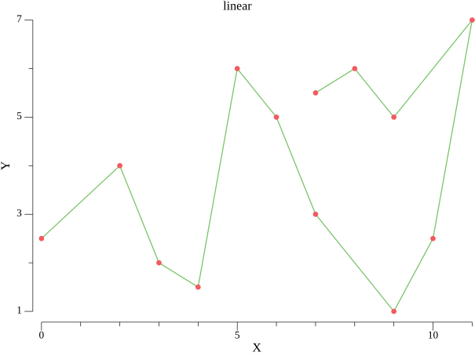
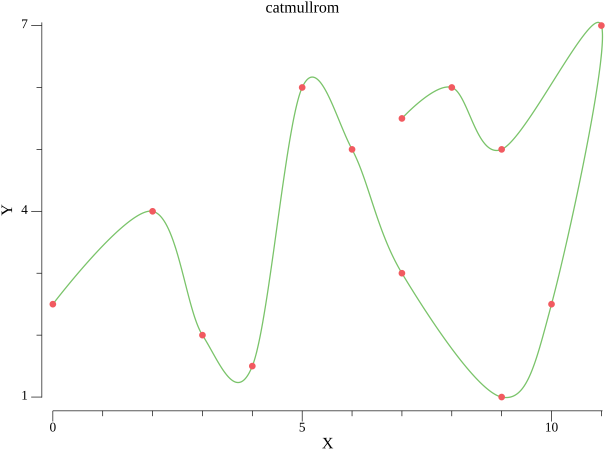
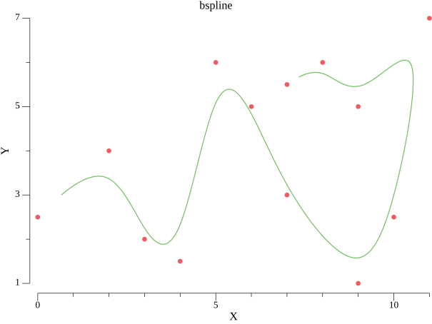

# Spline Package for Go

This spline package provides functionality for creating and evaluating various types of 2D splines in Go. Supported spline types include Linear, Catmull-Rom, and B-spline. This package is designed for ease of use and flexibility in handling 2D spline interpolation.

## Installation

To install this package, use the `go get` command with the module path:

```bash
go get github.com/robin-samuel/spline
```

This will fetch the package and its dependencies, making it ready to use in your Go project.

## Usage

The package allows you to create and work with three types of splines: Linear, Catmull-Rom, and B-spline. Here are examples of how to use each type:

### Linear Spline



```go
package main

import (
	"fmt"
	"github.com/robin-samuel/spline"
)

func main() {
	// Define points for the spline
	controllPoints := []spline.Point{
		{X: 0, Y: 2.5},
		{X: 2, Y: 4},
		{X: 3, Y: 2},
		{X: 4, Y: 1.5},
		{X: 5, Y: 6},
		{X: 6, Y: 5},
		{X: 7, Y: 3},
		{X: 9, Y: 1},
		{X: 10, Y: 2.5},
		{X: 11, Y: 7},
		{X: 9, Y: 5},
		{X: 8, Y: 6},
		{X: 7, Y: 5.5},
	}

	// Create a linear spline
	linear, err := spline.NewSpline(spline.Linear, controllPoints)
	if err != nil {
		panic(err)
	}

	// Evaluate the spline at t = 0.5
	pt := linear.At(0.5)
	fmt.Printf("Point on linear spline at t=0.5: (%.2f, %.2f)\n", pt.X, pt.Y)
	// Evaluate the spline Range
	points := linear.Range(0, float64((len(controllPoints) - 1)), 0.01)
	fmt.Printf("Points on linear spline: %v\n", points)
}
```

### Catmull-Rom Spline



```go
package main

import (
	"fmt"
	"github.com/robin-samuel/spline"
)

func main() {
	// Define points for the spline
	controllPoints := []spline.Point{
		{X: 0, Y: 2.5},
		{X: 2, Y: 4},
		{X: 3, Y: 2},
		{X: 4, Y: 1.5},
		{X: 5, Y: 6},
		{X: 6, Y: 5},
		{X: 7, Y: 3},
		{X: 9, Y: 1},
		{X: 10, Y: 2.5},
		{X: 11, Y: 7},
		{X: 9, Y: 5},
		{X: 8, Y: 6},
		{X: 7, Y: 5.5},
	}

	// Create a Catmull-Rom spline
	catmullRom, err := spline.NewSpline(spline.CatmullRom, controllPoints)
	if err != nil {
		panic(err)
	}

	// Evaluate the spline at t = 0.5
	pt := catmullRom.At(0.5)
	fmt.Printf("Point on Catmull-Rom spline at t=0.5: (%.2f, %.2f)\n", pt.X, pt.Y)
	// Evaluate the spline Range
	points := catmullRom.Range(0, float64((len(controllPoints) - 1)), 0.01)
	fmt.Printf("Points on Catmull-Rom spline: %v\n", points)
}
```

### B-Spline



```go
package main

import (
	"fmt"
	"github.com/robin-samuel/spline"
)

func main() {
	// Define points for the spline
	controllPoints := []spline.Point{
		{X: 0, Y: 2.5},
		{X: 2, Y: 4},
		{X: 3, Y: 2},
		{X: 4, Y: 1.5},
		{X: 5, Y: 6},
		{X: 6, Y: 5},
		{X: 7, Y: 3},
		{X: 9, Y: 1},
		{X: 10, Y: 2.5},
		{X: 11, Y: 7},
		{X: 9, Y: 5},
		{X: 8, Y: 6},
		{X: 7, Y: 5.5},
	}

	// Create a B-spline
	bspline, err := spline.NewSpline(spline.Bspline, controllPoints)
	if err != nil {
		panic(err)
	}

	// Evaluate the spline at t = 0.5
	pt := bspline.At(0.5)
	fmt.Printf("Point on B-spline at t=0.5: (%.2f, %.2f)\n", pt.X, pt.Y)
	// Evaluate the spline Range
	points := bspline.Range(0, float64((len(controllPoints) - 1)), 0.01)
	fmt.Printf("Points on B-spline: %v\n", points)
}
```

## Notes

- Every spline needs at least 2 control points to be created. If you provide less than 2 control points, the spline will not be created and an error will be returned.
- The parameter `t` in the `At` function typically ranges from 0 to 1, representing the start to the end of the spline. However, the `At` function will accept any value for `t` and will return the point on the spline at that value. For example, if you have a spline with 10 control points, you can evaluate the spline at `t = 5` and it will return the point on the spline at the 5th control point.
- The Catmull-Rom and B-spline uses by default 2 ghost points at the start and end of the spline. These ghost points are used to calculate the spline at the start and end of the spline. The ghost points are calculated by mirroring the first and last control points. If you do not want to use ghost points, you can set the ghost bool to false when creating the spline.
